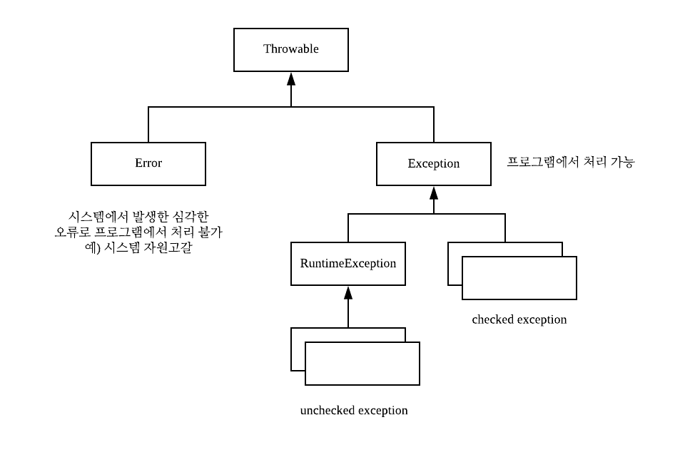

# 오류처리  
오류 처리 코드로 인해 프로그램 논리를 이해하기 어려워 진다면 깨끗한 코드라 부르기 어렵다.  
깨끗한 코드는 읽기도 좋아야 하지만 안정성도 높아야 한다.

## Exception 이란?
예외란 프로그램 실행 도중에 발생하는“예외적인 상황”이며, 정상적인 흐름을 방해한다.  
이러한 예외를 예측해서 복구하거나 정상종료 처리하는 것이 예외처리이다.  
 
## Java의 예외 클래스

## Java에서의 예외처리
 * Try-Catch-Finally
 * throws

## 오류 코드보다 예외를 사용하라
로직과 오류 처리를 분리해야한다.
그렇지 않을 경우 프로그램의 주 흐름을 구성하는 코드와 예외처리 코드가 혼재되어 코드가 복잡해진다.

## Try-Catch-Finally 문부터 작성하라
예외에서 프로그램 안에다 범위를 정의한다.

## 미확인(unchecked) 예외를 사용하라
확인된 예외는 OCP를 위반한다.  
메소드에서 확인된 예외를 던졌는데 catch 블록이 세 단계 위에 있다면 그 사이 메소드 모두가 선언부에 해당 예외를 정의해야한다.   
하위 단계에서 코드를 변경하면 상위 단계 메소드 선언부를 전부 고쳐야한다.  
모든 메소드가 최하위 메소드에서 던지는 예외를 알아야 하므로 캡슐화가 깨진다.  

## 예외에 의미를 제공하라
오류 메시지에 정보를 담아 예외와 함께 던진다.  
(catch블록에서 오류를 기록하도록 충분한 정보)

## 호출자를 고려해 예외 클래스를 정의하라
오류를 분류하는 다양한 방법이 존재한다.  
* 오류가 발생한 위치 (오류가 발생한 컴포넌트)
* 오류 유형 (예. 디바이스 실패, 네트워크 실패, 프로그래밍 오류 등)  

오류를 정의할 때 가장 중요한 것은 오류를 잡아내는 방법이다.
외부API를 사용할 때는 감싸서 처리하면 유용하다.

## 정상 흐름을 정의하라
클래스나 객체가 예외적인 상황을 캠슐화해서 처리하면 클라리언트 코드가 예외적인 상황을 처리할 필요가 없다.

## null을 반환하지 마라
null을 반환하는 코드는 일거리를 늘릴 뿐만 아니라 호출자에게 문제를 떠넘긴다.  
null 확인을 빼먹는다면 오류가 발생한다.

## null을 전달하지 마라
정상적인 인수로 null을 기대하는 API가 아니라면 메소드로 null을 전달하는 코드는 최대한 피한다.

> 출처  
클린코드 (로버트 C 마틴)
